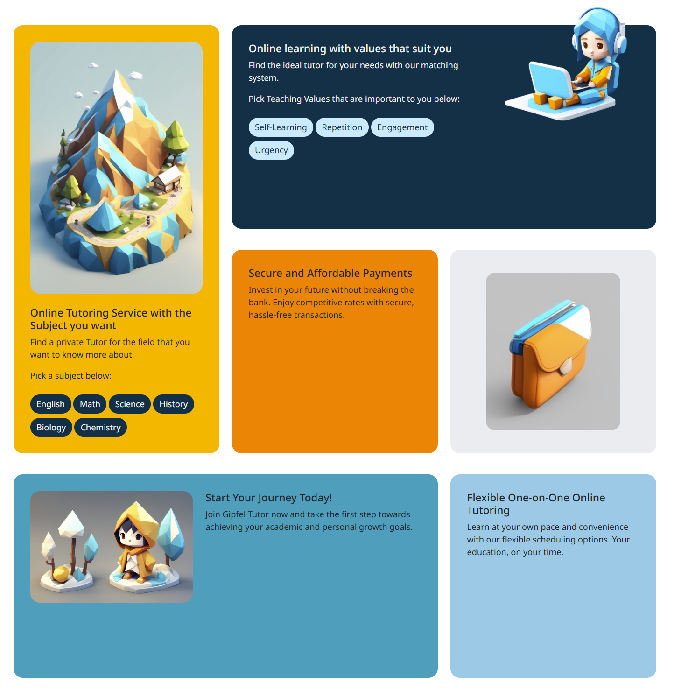
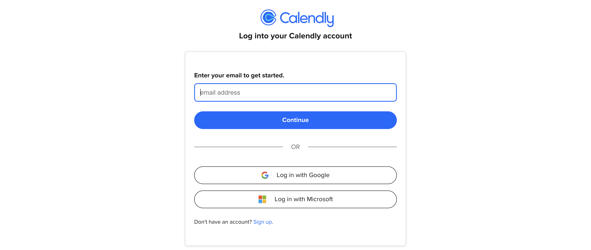
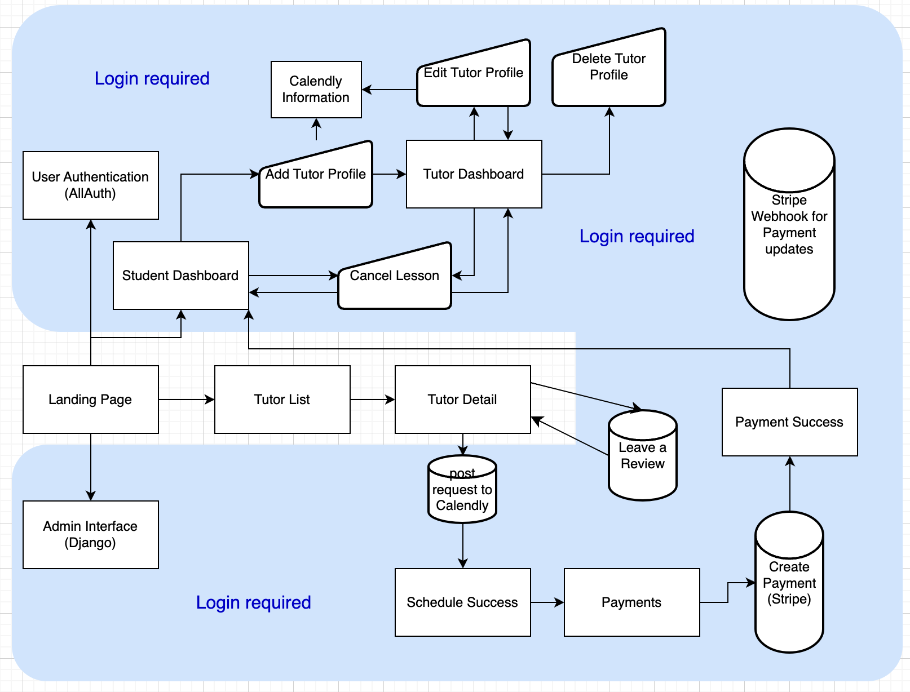
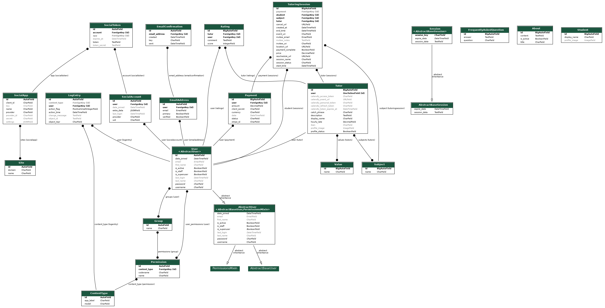

# GIPFEL TUTOR

[Experience our live website here!](https://gipfel-tutor-768a610dc54f.herokuapp.com)

[](https://github.com/benschaf/gipfel-tutor/commits/main)
[](https://github.com/benschaf/gipfel-tutor/commits/main)
[](https://github.com/benschaf/gipfel-tutor/issues)
[](https://github.com/benschaf/gipfel-tutor/issues?q=is%3Aissue+is%3Aclosed)
[](https://github.com/benschaf/gipfel-tutor)
[](https://www.python.org/downloads/release/python-3121/)
[](https://www.heroku.com/)


Welcome to Gipfel Tutor, the pinnacle of personalized tutoring! Our Django-powered marketplace pairs you with the perfect tutor to conquer your academic peaks. Quick, simple, and effective — scale new heights in learning with us!

> ## Our Mission: "Connect learners with a highly suitable tutor for their specific **needs** and **preferences**, within **48 hours**."

> ## Top Technical Features
> 1. **Credit Card Payments using Stripe**: Securely pay for lessons online.
> 2. **Calendly API v2 Integration**: Schedule and Cancel lessons seamlessly from the site.
> 3. **Socialaccount Login**: Sign in with Google for a passwordless and modern experience. (also adds Google Pay to Stripe payments)


⤴️ source: [amiresponsive](https://ui.dev/amiresponsive?url=https://gipfel-tutor-768a610dc54f.herokuapp.com)

## UX

### Colour Scheme

The colour scheme follows a **bright and engaging** palette that is both **professional** and **friendly**. It suits the **educational** theme of the site and is designed to appeal to a younger student and tutor demographic.

- Selective Yellow: `#FFB703` used for Primary emphasis.
- UT Orange: `#FB8500` used for secondary emphasis.
- Sky blue: `#8ECAE6` used for light emphasis.
- Blue Green: `#219EBC` used for darker emphasis.
- Prussian Blue: `#023047` used for dark bakgrounds.

I used [coolors.co](https://coolors.co/8ecae6-219ebc-023047-ffb703-fb8500) to generate my colour palette.


I've used CSS `:root` variables to easily update the global colour scheme by changing only one value, instead of everywhere in the CSS file.

**File**: [base.css](static/css/base.css)
```css
:root {
    --my-blue-green: #219EBC;
    --my-prussian-blue: #023047;
    --my-ut-oragne: #FB8500;
    --my-font-serif: "Noto serif", Arial, serif;
}
```

Additionally I've adapted the bootstrap variables to match the colour scheme. This was done according to [a blogpost by bootstrap](https://blog.getbootstrap.com/2022/05/16/using-bootstrap-css-vars/).

**File**: [custom_bootstrap.css](static/css/custom_bootstrap.css)
```css
:root,
[data-bs-theme=light] {

  /* Custom Styles */
  --bs-black: #0f0f0f;

  --bs-light: #f2f2f2;
  --bs-light-rgb: 242, 242, 242;

  --bs-body-bg: #fff;
  --bs-body-bg-rgb: 255, 255, 255;

  --bs-primary: #FFB703;
  --bs-primary-rgb: 255, 183, 3;
  --bs-primary-shaded: #FFC533;

  --bs-secondary: #8ecae6;
  --bs-secondary-rgb: 142, 202, 230;
  --bs-secondary-shaded: #ABD8ED;

  --bs-dark: #023047;
  --bs-dark-rgb: 2, 48, 71;
  --bs-dark-shaded: #034363;

  --bs-btn-light: #C3EAFD;
  --bs-btn-light-rgb: 195, 234, 253;
  --bs-btn-light-shaded: #9CDCFC;

  --bs-success: #198754;
  --bs-success-rgb: 25, 135, 84;
  --bs-success-shaded: #2CAE6A;

  --bs-border-style: none;
  --bs-border-radius: 1.125rem;
  --bs-border-radius-lg: 2rem;

  --bs-font-sans-serif: "Noto Sans", "Liberation Sans", Arial, sans-serif, "Apple Color Emoji", "Segoe UI Emoji", "Segoe UI Symbol", "Noto Color Emoji";

  ...
}
```

### Typography

- [Noto Sans](https://fonts.google.com/specimen/Noto+Sans) was used for body text to ensure readability, accessibility, and familiarity.
- [Josefin Sans](https://fonts.google.com/specimen/Josefin+Sans) was used for headings to provide a modern and engaging look.
- [Font Awesome](https://fontawesome.com) was used for all icons on the site, providing a consistent and professional look.

## User Stories

The user stories are based on the user personas (To be found at the bottom of the document under **Design Thinking Process**) and the features of the app.

Each user story is followed by a set of acceptance criteria that must be met for the story to be considered complete.

> [!IMPORTANT]
> Make sure to also check out the [**User Story Map**](https://github.com/users/benschaf/projects/12/views/3) which was used extensively during the development process. It provides a more visual representation of the user stories and shows them **grouped by epic** along with their **priority** and **status**.

<details>
<summary>Click To expand User Stories right here</summary>

### Viewing and navigation

| User Story | Acceptance Criteria |
| --- | --- |
| As a **first time visitor**, I want to be able to understand the purpose of the site so that I can decide if I want to sign up. | 1. The homepage should clearly explain the purpose of the site. <br> 2. The homepage should have a call-to-action button to sign up. |
| As a **student**, I want to be able to view a list of tutors so that I can choose the best tutor for my needs. | 1. The site should have a page that lists all available tutors. <br> 2. Each tutor should have at least their profile picture, name, and hourly rate displayed.<br> 3. There should be obvious "book trial lesson" CTA Buttons. |
| _NOT MVP (not part of the **M**inimu **V**iable **P**roduct):_ As a **student**, I want to be able to like and save tutors so that I can easily find them later. | |

### Searching, filtering, and sorting

| User Story | Acceptance Criteria |
| --- | --- |
| As a **student**, I want to be able to filter tutors based on teaching experience and ratings so that I can choose a highly qualified tutor. | 1. The site should have a filter option to select tutors based on preference tags. <br> 2. The site should have a filter option to select tutors based taught subjects. |
| As a **student**, I want to be able to sort tutors based on hourly rates and ratings so that I can find an affordable and highly rated tutor. | 1. The site should have a sorting option to sort tutors based on hourly rates. <br> 2. The site should have a sorting option to sort tutors based on ratings. |
| As a **student**, I want to be able to search for tutors based on their name, description, subject expertise, and teaching values so that I can find a tutor that closely aligns with my needs. | 1. The search bar should have the ability to search for tutors by their name. <br> 2. The search bar should have the ability to search for tutors based on their description. <br> 3. The search bar should have the ability to search for tutors based on their subject expertise. <br> 4. The search bar should have the ability to search for tutors based on their teaching values. Those Values should be implemented using Tags the tutors can pick from. (limited amount of picks to ensure diversity) |

### Registration and user Accounts

| User Story | Acceptance Criteria |
| --- | --- |
| As a **user**, I want to be able to create either a student or tutor account so that I can access the platform. | 1. The platform should provide an option to create a student or tutor account. |
| As a **user**, I want to be able to log in and log out of my account so that I can access my profile and bookings. | 1. The platform should have a login functionality.<br>2. The platform should have a logout functionality. |
| As a **user**, I want to be able to reset my password in case I forget it so that I can regain access to my account. | 1. The platform should provide a password reset option. |
| As a **user**, I want to receive a confirmation email after registering so that I can verify my account. | 1. The platform should send a confirmation email upon successful registration.<br>2. The email should enable account email verification |
| As a **student**, I want to be able to see my booking history, upcoming lessons, payment details, and my liked tutors so that I can manage my account. | 1. The student's account should display booking history.<br>2. The student's account should display upcoming lessons.<br>3. The student's account should display payment details.<br>4. The student's account should display liked tutors. |
| As a **tutor**, I want to be able to see my booking history, upcoming lessons, bank details, and my currently booked students so that I can manage my account. | 1. The tutor's account should display booking history.<br>2. The tutor's account should display upcoming lessons.<br>3. The tutor's account should display bank details.<br>4. The tutor's account should display currently booked students. |

### Tutor profiles

| User Story | Acceptance Criteria |
| --- | --- |
| As a **student**, I want to be able to view detailed tutor profiles so that I can learn more about the tutor's experience and teaching values. | 1. Each tutor should have a detailed profile page with at least their name, profile picture, hourly rate, description, and teaching values(implemented using Tags they can pick from). <br> 2. The profile page should also display the tutor's ratings and reviews. |
| As a **tutor**, I want to be able to create a detailed tutor profile so that students can learn more about me. | 1. The platform should provide a feature to create a detailed tutor profile.<br>2. There should be some form of enhanced Text editing tools. |
| As a **tutor**, I want to be able to set my availability and hourly rates so that students can book lessons with me. | 1. The tutor should be able to set their availability.<br>2. The tutor should be able to set their hourly rates. |
| As a **tutor**, I want to be able to receive booking requests from students so that I can confirm lessons. | 1. The tutor should receive booking requests from students.<br>2. He should be able to answer to the requests. |
| As a **student**, I want to be able to leave a review and rating for a tutor after a lesson so that other students can benefit from my experience. | 1. The student should have the option to leave a review for a tutor after a lesson.<br>2. The student should have the option to leave a rating for a tutor after a lesson. |

### Booking and scheduling

| User Story | Acceptance Criteria |
| --- | --- |
| As a **student**, I want to be able to schedule regular lessons with a tutor so that I can improve my academic performance. | 1. The student should be able to schedule regular lessons with a tutor. |
| As a **student**, I want to be able to pay for lessons online so that I can easily book and confirm lessons. | 1. The student should have the option to pay for lessons online. |
| As a **student**, I want to be notified of successful or failed payments so that I can keep track of my bookings. | 1. The student should receive notifications for successful payments.<br>2. The student should receive notifications for failed payments. |
| _NOT MVP:_ As a **student**, I want to be able to book a trial lesson with a tutor so that I can see if the tutor is a good fit for me. |

### Admin

| User Story | Acceptance Criteria |
| --- | --- |
| As an **admin**, I want to be able to add, edit, and delete tutors so that I can manage the platform. | 1. The admin should have the ability to add tutors.<br>2. The admin should have the ability to edit tutors.<br>3. The admin should have the ability to delete tutors. |
| As an **admin**, I want to be able to view and manage user accounts so that I can ensure the security of the platform. | 1. The admin should have the ability to view user accounts.<br>2. The admin should have the ability to manage user accounts. |
| As a **Site Owner**, I want the site to Employ Search Engine Optimisation (SEO) techniques to improve audience reach. (Compare LO3 in Code Institute Project Requirements) | 1. The site should employ SEO techniques to improve audience reach. |
| _NOT MVP:_ As an **admin**, I want to be able to view and manage bookings and payments so that I can ensure the smooth operation of the platform. |

### Marketing and Business Strategy

| User Story | Acceptance Criteria |
| --- | --- |
| As a **Site Owner**, I want to have a Facebook Business Page to promote the site and attract more users. (Compare LO5 in Code Institute Project Requirements) | 1. The Site Owner should have a Facebook Business Page to promote the site. |
| As a **Site Owner**, I want to provide a Newsletter to keep site visitors informed about new features and updates. (Compare LO5 in Code Institute Project Requirements) | 1. The Site Owner should provide a Newsletter to keep site visitors informed. |
| As a **Site Owner**, I want to have a documentation of the ecommerce business model. (Compare LO6 in Code Institute Project Requirements) | 1. The Site Owner should have documentation of the ecommerce business model. |
</details>

## Wireframes

To follow best practice, wireframes were developed for mobile, tablet, and desktop sizes.
I've used [draw.io](https://balsamiq.com/wireframes) to design my site wireframes.

View the [original draw.io file](https://drive.google.com/file/d/1OUjOdhZI-Dq6OR5pPkPgPQIQ4jyU9k51/view?usp=sharing) of the wireframes. (click on the "Open with" button and select "draw.io")

<details>
<summary>Click to expand wireframes</summary>

| Page | Mobile Wireframe | Tablet Wireframe | Desktop Wireframe |
| --- | --- | --- | --- |
| Landing Page |  |  |  |
| Tutor List |  |  |  |
| Tutor Detail |  |  |  |
| Schedule / Payment Success |  |  |  |
| Payment (Checkout) |  |  |  |
| Student Dashboard |  |  |  |
| Tutor Dashboard |  |  |  |
| Single Forms (Allauth forms / Tutor Profile forms) |  |  |  |
| FAQ |  |  |  |
| About |  |  |  |
| Calendly Information |  |  |  |
</details>

## Features

### Inviting landing Page

When first visiting the site, users are greeted with a clean, modern and inviting landing page. It includes a hero section with an image and a CTA Button. Further down the page, users will find an interactive section with a couple of different options to get started searching for a tutor.

The interactive Section is designed using a bento box layout, which is a modern and engaging way to present information. It allows users to quickly get an overview of the site's features and benefits.

The landing page is designed to be simple and user-friendly, providing a quick overview of the site's purpose and functionality. It encourages users to explore the site further and get started with their waste management journey.


⤴️ Screenshot of the landing page
<hr>



⤴️ Screenshot of the Bento Box Layout

relevant project files: [index.html](core/templates/core/index.html)

### Navigation Bar with the most important links

The navigation bar is fixed at the top of the page, ensuring easy access to the most important links. It includes the text-logo (which is a link to the homepage), a CTA Button-Link to the Tutor List, the  the dashboard and login/register. The Dashboard Link is hidden to logged out users and the login/register links are hidden to logged in users and will show them a logout link instead.

The Navigation bar also shows an "Admin" link to users that are flagged as "Staff" in the Django Admin Panel.

The navigation bar is designed to be simple and intuitive, providing quick access to the site's main features. It is responsive and collapses into a hamburger menu on smaller screens using the Bootstrap framework.


⤴️ Screenshot of the navigation bar

Some custom Javascript code was used to change the navigation bar's opacity once scrolling down the page. This was done to make the hero section of the landing page cleaner and more focused.

relevant project files: [base.html](templates/base.html), [index.js](core/static/core/js/index.js)

### Footer with Site Links, Social Media Links and a Mailchimp Signup Form

The footer includes Links to the Home, FAQs and About pages. It also includes links to the site's social media profiles (Facebook, Instagram, Github). Additionally, there is a Mailchimp Signup Form to allow users to subscribe to the site's newsletter.

- Github link: Links to my github profile: [benschaf](https://github.com/benschaf)
- Facebook link: Links to a custom made facebook page: [Gipfel Tutor](https://www.facebook.com/profile.php?id=61563566265782)
- Instagram link: Links to the instagram main site: [Instagram](https://www.instagram.com/)

The footer is designed to be simple and informative, providing users with quick access to important site links and social media profiles. It is responsive and collapses into a single column on smaller screens using the Bootstrap framework.


⤴️ Screenshot of the footer

relevant project files: [base.html](templates/base.html)

### About Page

The About page provides a brief overview of the site's purpose and the creator. The content of the About page can by dynamically changed by the site owner in the Django Admin Panel. For this, the Site owner Account needs to be added to the "Site Owner Admin" Authentication Group.

The About page is designed to be informative, providing users with background information. It helps to establish trust and credibility with users, ensuring they feel comfortable using the site.


⤴️ Screenshot of the about page

relevant project files: [about.html](core/templates/core/about.html)

### FAQ Page

The FAQ page provides answers to common questions users may have about the site. The content of the FAQ page can be dynamically changed by a Staff member in the Django Admin Panel. For this, the Staff Account needs to be added to the "Customer Service Admin" Authentication Group.

The FAQ page is designed using bootstraps accordion component, which allows users to easily find the information they are looking for. It helps to reduce the number of support requests and ensures users have a positive experience on the site.


⤴️ Screenshot of the FAQ page

relevant project files: [faq.html](core/templates/core/faq.html)

### Tutor List Page and Search Functionality

The Tutor List page displays a list of all available tutors. Each tutor is displayed in a card format, showing their profile picture, name, hourly rate, and a brief description. The cards are designed to be visually appealing and informative, helping users quickly find a tutor that meets their needs. Most importantly the cards have a visible CTA Button to book a lesson with the tutor.

At the top of the Tutor List page, users can filter tutors based on their subjects and teaching values - or they can search for a specific tutor by name, catch phrase or description using the search bar. Search results can be sorted using the simplified sorting options below the search box.

The Tutor List page is designed to be user-friendly and interactive, providing users with the tools they need to find the perfect tutor. It helps users quickly narrow down their search and make an informed decision.


⤴️ Screenshot of the tutor list page

relevant project files: [tutor_list.html](tutor_market/templates/tutor_market/tutor_list.html)

### Tutor Detail Page

The Tutor Detail page provides a detailed profile of a specific tutor. It includes the tutor's profile picture, name, hourly rate, description, teaching values, and ratings. Additionally, users can see the tutor's availability and book a lesson with them. Lastly the tutor's reviews are displayed at the bottom of the page.

The Tutor Detail page is designed to be informative and engaging, providing users with all the information they need to make an informed decision. It helps users learn more about a tutor and decide if they are the right fit for their needs.


⤴️ Screenshot of the tutor detail page

relevant project files: [tutor_detail.html](tutor_market/templates/tutor_market/tutor_detail.html)


### Tutor reviews

The Tutor reviews are displayed on the tutor detail page. They include the student's name, the review text, and the star rating. Above the reviews, the average rating of the tutor is displayed including a bar chart that visualizes the distribution of the ratings.

The reviews are designed to be informative and engaging, providing users with feedback from other students. They help users make an informed decision and build trust with the tutor.


⤴️ Screenshot of the tutor reviews

relevant project files: [tutor_detail.html](tutor_market/templates/tutor_market/tutor_detail.html)

### Calendly Scheduling Integration

The Calendly Scheduling Integration allows users to schedule lessons with tutors directly from the Tutor Detail page. The Calendly widget is embedded on the page and displays the tutor's availability. Users can select a date and time that works for them and book a lesson with the tutor.

The Calendly Scheduling Integration is implemented using the **Calendly API v2** and **OAuth2.0**. A tutor can connect their Calendly account to the site in their tutor dashboard. Once connected, the tutor's availability and the status of any lesson is **automatically synced with the site**, ensuring users can book and cancel lessons at their convenience. The calendly webhooks were not used, as they are a paid feature - therefore any changes to events on the calendly site are not automatically reflected on Gipfel Tutor.

Upon booking a lesson, the user receives a confirmation email from Calendly and is redirected to a success page on the site. The tutor also receives a notification email from Calendly and can manage the lesson from their Dashboard.


⤴️ Screenshot of the Calendly Scheduling Integration


⤴️ Screenshot of the Calendly Success Page

relevant project files: [tutor_detail.html](tutor_market/templates/tutor_market/tutor_detail.html), [tutor_detail.js](tutor_market/static/tutor_market/js/tutor_detail.js)

All Calendly OAuth2.0 related code is stored in the [calendly](calendly) app and can be reused in other projects. The main functionality is handling the refresh token and the access token used by the Calendly API.

### Payments with Stripe

The Payments with Stripe feature allows users to pay for lessons online. Users can choose, when they want to pay for the lessons that they have booked. If they choose to go to the payment page either from their dashboard or from the tutor detail page, they will be redirected to the payment page. There they will see a list of all their upcoming lessons and the total amount they have to pay. They can then enter their credit card details and pay for the lessons. If they are signed in using their google account, they can also use the google pay feature.

The Payments with Stripe feature is implemented using [Custom payment flow documented by Stripe](https://docs.stripe.com/payments/quickstart) and includes **webhook hadnling** to ensure the payment status is updated in the site's database.

Once a users payment is successful, they are redirected to a success page on the site. The user does not yet receive a confirmation email from the site, but this feature is planned for a future update.


⤴️ Screenshot of the Payments with Stripe feature


⤴️ Screenshot of the Payment Success Page

relevant project files: [payment.html](booking/templates/booking/payment.html), [payment.js](booking/static/booking/js/payment.js)

### User Authentication with Allauth (including Socialaccount Login)

The User Authentication with Allauth feature allows users to create an account, log in, log out, reset their password and manage their account email. The feature is implemented using the **Django Allauth** package and includes **email verification** to ensure the security of user accounts. Additionally, the feature includes **social media login** using Google.

The socical media login feature comes in very handy in combination with **Calendly** and **Stripe**. For Calendly it allows a more seamless integration of the scheduling feature for tutors and for Stripe it allows **Google Pay** to be used as a payment method.

The Project is running Allauth Version: 0.63.3. This means that it is very convenient to adapt the templates which are heavily reliant on django template tags. Basically all Styling could be achieved by only changing one template file:

file: [templates/account/allauth/base.html](templates/allauth/layouts/base.html)
```html


  {{ block.super }}
  # Wrapping the block Content in a card by adding the wrapping
  # divs to the page_header and post_content blocks
  <div class="container navbar-margin mb-5">
    <div class="row justify-content-center mt-3">
      <div class="col col-lg-5">
        <div class="card mt-2 auth-card">
          <div class="card-body p-5">
          
          
          </div>
        </div>
      </div>
    </div>
  </div>


```
All other templates are extending this base.html file and only need to adapt their content block tag to add their form or content to the card above.

The google login Button was styled using the [Google Sign-In Branding Guidelines](https://developers.google.com/identity/branding-guidelines)


⤴️ Screenshot of the User Authentication with Allauth feature


⤴️ Screenshot of the Google Login confirm Screen

The Django Allauth package provides more templates that are not all documented here, but they are working on the site.

relevant project files: [base.html](templates/base.html), [login.html](templates/account/login.html), [signup.html](templates/account/signup.html), [password_reset.html](templates/account/password_reset.html), [email.html](templates/account/email.html), [allauth/base.html](templates/allauth/layouts/base.html)

### User Dashboard

The user Dashboard provides users with an overview of their account. It includes a list of upcoming lessons, booking history, and payment history. Additionally, users can manage their account email and password. Unpaid lessons are displayed with an additional "Pay Now" Button. Lessons can also be canceled from the dashboard. Lastly, the dashboard includes a button that lets the user sign up as a tutor.

The user Dashboard is designed to be informative and user-friendly, providing users with all the information they need to manage their account. It helps users keep track of their lessons and payments and ensures they have a positive experience on the site.


⤴️ Screenshot of the Student Dashboard

relevant project files: [student_dashboard.html](tutor_market/templates/tutor_market/student_dashboard.html)

### Tutor Dashboard

The Tutor Dashboard provides tutors with an overview of their account. It includes a list of upcoming lessons, lessons that are waiting for confirmation, and an overview over all their students and upcoming lessons with them. Additionally, tutors can manage their account email, password and tutor profile. On the tutor dashboard, tutors can also connect their Calendly account to the site. At the bottom they have the option to delete their tutor profile.

If a tutor hasn't provided all necessary information to be displayed on the site yet - especially their calendly account, they will see a warning message at the top of the page informing them that their account will not be displayed on the site until they have provided the necessary information.

The Tutor Dashboard is designed to be informative and user-friendly, providing tutors with all the information they need to manage their account. It helps tutors keep track of their lessons and students and ensures they have a positive experience on the site.


⤴️ Screenshot of the Tutor Dashboard



⤴️ Screenshot of the Connect Calendly process

relevant project files: [tutor_dashboard.html](tutor_market/templates/tutor_market/tutor_dashboard.html)

### Tutor Card and Lesson list item include blocks

The Tutor Card and the Lesson list item are used on the Tutor List page, the Tutor Detail page and the Tutor Dashboard. They are designed to be visually appealing and informative, providing users with all the information they need to make an informed decision. They are accessed in the django templates using the include tag. Using the with keyword, the context of the include block can be changed to display different information depending on the session user and the context on the page.

The lesson list item is used to display a single lesson as an item of a list and is used in the Tutor Detail view and the Student and Tutor Dashboards. It can be accessed using the include tag in the django templates as well and has similar customization options using the with keyword.

Example call to the tutor card include block:

file: [tutor_dashboard.html](tutor_market/templates/tutor_market/tutor_dashboard.html)
```html

```


⤴️ Screenshot of the Tutor Card


⤴️ Screenshot of a Lesson List

relevant project files: [tutor_card.html](tutor_market/templates/tutor_market/includes/tutor_card.html), [lesson_list_item.html](tutor_market/templates/tutor_market/includes/lesson_list_item.html)

### Admin Panel

The Django Admin Panel is used to manage the site's content and users. It provides an easy-to-use interface for site owners and staff members. Logged in users of the site can be flagged as "Staff" and added to a specific Authentication Group to access the Admin Panel with permissions appropriate to their role. The following Groups are avaliable in the Admin Panel:

- **Site Owner Admin**: Has full CRUD access to the FAQ and About pages.
- **Customer Service Admin**: Can view and delete users email addresses. Can view users and Authentication Groups. Full CRUD access to payments and tutoring sessions. Can view and delete ratings. Can view and add subjects. Can change, delete and view tutors.

These Permissions should allow staff members to manage the site effectively, provide customer support, and ensure the security of user accounts.


⤴️ Screenshot of the Admin Panel

relevant project files: [allauth_groups_fixture.json](fixtures/allauth_groups_fixture.json)

### Mailchimp Newsletter form

In the footer of the site, users can subscribe to the site's newsletter using the Mailchimp Newsletter form. The form is designed to be simple and user-friendly, providing users with an easy way to stay informed about new features and updates. The form is implemented using a generated template from the Mailchimp website. The design is adapted to fit the site's color scheme and branding but still sticks out as a Mailchimp form, sticking to the Mailchimp Branding Guidelines.

Mailchimp provides security and validation features out of the box.

Emails are collected using the site owners Mailchimp account. Momentarily, no emails are sent out to the subscribers, but this feature is planned for a future update.


⤴️ Screenshot of the Mailchimp Newsletter form

relevant project files: [base.html](templates/base.html)

### Django messages

Django messages are used to provide feedback to users after they perform an action on the site. Messages are displayed at the bottom left of the screen. They are used to inform users about successful actions, errors, and warnings. The messages are designed to be simple and informative, providing users with feedback about their actions. Users can dismiss the messages by clicking the close button.


⤴️ Screenshot of the Django messages

relevant project files: [base.html](templates/base.html)

### Responsive Design

The site is designed to be responsive and work on all devices. It includes breakpoints for mobile, tablet, and desktop sizes. The site is designed using the Bootstrap framework, which provides a responsive grid system and components. The site is tested on multiple devices and browsers to ensure compatibility.

The responsive design ensures users have a positive experience on the site. Especially mobile users can easily navigate the site and access all features as mobile users are the expected main user group.


⤴️ Screenshot of the responsive design

relevant project files: All template files.

### Future Features

Many features were planned for the site but could not be implemented due to time constraints. Some of the planned features include:

- Feedback on singular lessons
    - After a lesson, the student should be able to give feedback on the lesson. This feedback should be visible to the tutor and the student in their dashboards. At the moment, any logged-in user except from the tutur himself can post feedback on a tutor.
- Chat system for students and tutors
    - A chat system should be implemented to allow students and tutors to communicate directly on the site. This would make it easier to set up and organize lessons between students and tutors. At the moment, tutors and students can only communicate via email.
- Stripe confirmation emails
    - After a successful payment, the user should receive a confirmation email. This would provide users with a receipt and ensure they have a record of their payment. At the moment, the user is only redirected to a success page on the site.

> [!NOTE]
> Make sure to have a look at the [User Story Map](https://github.com/users/benschaf/projects/12/views/3) to see smaller additions and quality of life improvements that are planned for the site. Just have a look at the "Should Have" and "Could Have" Columns.


## Tools & Technologies Used

- [](https://tim.2bn.dev/markdown-builder) used to generate README and TESTING templates.
- [](https://git-scm.com) used for version control. (`git add`, `git commit`, `git push`)
- [](https://github.com) used for secure online code storage.
- [](https://gitpod.io) used as a cloud-based IDE for development.
- [](https://en.wikipedia.org/wiki/HTML) used for the main site content.
- [](https://en.wikipedia.org/wiki/CSS) used for the main site design and layout.
- [](https://www.javascript.com) used for user interaction on the site.
- [](https://jquery.com) used for user interaction on the site.
- [](https://www.python.org) used as the back-end programming language.
- [](https://www.heroku.com) used for hosting the deployed back-end site.
- [](https://getbootstrap.com) used as the front-end CSS framework for modern responsiveness and pre-built components.
- [](https://jestjs.io) used for automated JavaScript testing.
- [](https://www.djangoproject.com) used as the Python framework for the site.
- [](https://www.postgresql.org) used as the relational database management.
- [](https://dbs.ci-dbs.net) used as the Postgres database from Code Institute.
- [](https://whitenoise.readthedocs.io) used for serving static files with Heroku.
- [](https://stripe.com) used for online secure payments of ecommerce products/services.
- [](https://mailchimp.com) used for sending newsletter subscriptions.
- [](https://aws.amazon.com/s3) used for online static file storage.
- [](https://fontawesome.com) used for the icons.
- [](https://chatopenai.de/) used to help debug, troubleshoot, and explain things.
-  used to provide scheduling functionality for tutors.
-  used to format the template .html files
-  used to lint and format the Django code
-  used to provide Django support in VSCode
- [](https://docs.allauth.org/en/latest/) used for user registration and login.
- [](https://django-crispy-forms.readthedocs.io) used to style Django forms.
- [](https://coolors.co) used to generate the colour palette.
- [](https://draw.io) used to design the wireframes.
- [](https://pixlr.com) used to edit images.
- [](https://autoprefixer.github.io) used to add vendor prefixes to CSS.
- [](https://github.com/tcort/markdown-link-check) used to check for broken links in the documentation files.

## User Journey Flowchart

Below is a flowchart that outlines the user journey on the site. It shows the different paths a user can take and the actions they can perform. One focus of the site is to provide as much access to users that aren't logged in yet as possible. Users can view all tutors and their profiles without being logged in. They only need to log in or sign up once they want to book a lesson.

[flowchart link](https://drive.google.com/file/d/1k-WFUWeaEafaomXcuk4rCSmGXS4WIFbf/view?usp=sharing)



⤴️ Flowchart of the User Journey

## Database Design

A relational database was used for this project. The database schema was designed using [dbdiagram.io](https://dbdiagram.io) before development began. The schema was then implemented using Django's built-in ORM. Throughout the development process, the schema was adjusted and updated as needed. The initial and the final version of the schema can be found below.

### Initial ERD
At the core of the Database is the `Tutor`model which represents a tutor and saves all the information about them. The `Tutor` model has relationships to `students` via the `TutoringSession` model which represents a single lesson. Payments are linked to a groupf of `TutoringSessions` and are represented by the `Payment` model. Further models and relationships can be seen in the ERD below.

[dbdiagram link](https://dbdiagram.io/d/ERD_tutor_service-667c0ec99939893dae536ebe)


⤴️ the initial ERD

Below is the ORM code that was used for the `Tutor` model:

file: [models.py](tutor_market/models.py)
```python
class Tutor(models.Model):
    user = models.OneToOneField('auth.User', on_delete=models.CASCADE, related_name='tutor')
    display_name = models.CharField(max_length=200)
    subjects = models.ManyToManyField('Subject', related_name='tutors')
    # -> Credit for decimal fields: https://docs.djangoproject.com/en/5.0/ref/models/fields/#decimalfield  # noqa
    hourly_rate = models.DecimalField(max_digits=6, decimal_places=2)
    catch_phrase = models.CharField(max_length=200, default='Tutoring with a smile!')
    description = models.TextField()
    profile_image = models.ImageField(upload_to='tutor_images', null=True, blank=True)
    values = models.ManyToManyField('Value', related_name='tutors')
    iban = models.CharField(max_length=34, null=True, blank=True)
    calendly_event_url = models.URLField(null=True, blank=True)
    calendly_personal_token = models.CharField(max_length=600, null=True, blank=True)

    calendly_access_token = models.CharField(max_length=600, null=True, blank=True)
    calendly_refresh_token = models.CharField(max_length=600, null=True, blank=True)
    calendly_token_expires_at = models.DateTimeField(null=True, blank=True)

    profile_status = models.BooleanField(default=False)

    def average_rating(self):
        """
        Returns the average rating of the tutor from all related Rating
        objects.
        """
        return Rating.objects.filter(tutor=self).aggregate(Avg('score'))

    def __str__(self):
        return self.display_name

    class Meta:
        ordering = ['display_name']
```

### Final ERD
I have used `pygraphviz` and `django-extensions` to auto-generate an ERD.

The steps taken were as follows:
- In the terminal: `sudo apt update`
- then: `sudo apt-get install python3-dev graphviz libgraphviz-dev pkg-config`
- then type `Y` to proceed
- then: `pip3 install django-extensions pygraphviz`
- in my `settings.py` file, I added the following to my `INSTALLED_APPS`:
```python
INSTALLED_APPS = [
    ...
    'django_extensions',
    ...
]
```
- back in the terminal: `python3 manage.py graph_models -a -o documentation/erd_final.png`
- removed `'django_extensions',` from my `INSTALLED_APPS`
- finally, in the terminal: `pip3 uninstall django-extensions pygraphviz -y`

Note that the `Student` model was dropped in the final version of the site. The `User` model is used directly instead to represent students.



⤴️ the final ERD

source for django ERD generation: [medium.com](https://medium.com/@yathomasi1/1-using-django-extensions-to-visualize-the-database-diagram-in-django-application-c5fa7e710e16)

## Agile Development Process

### GitHub Projects

[GitHub Projects](https://github.com/users/benschaf/projects/12/views/3) served as an Agile tool for this project.
It isn't a specialized tool, but with the right tags and project creation/issue assignments, it can be made to work.

Through it, user stories, issues, and milestone tasks were planned, then tracked on a weekly basis using the basic Kanban board.

User stories are grouped by Epic and MoSCoW priority. The epics were determined before development began as part of the design process. Epics are represented as milestones in the GitHub Project while MoSCoW priorites are represented in a custom project field.

In depth information about the conception of the idea for the site and the User Stories can be found under the Design Thinking Progress section at the bottom of this file.

Throughout the development process, user stories were reevaluated after each iteration and adjusted accordingly. Many tasks were created based off of each User story. These tasks were mainly organized in a [Kanban Board](https://github.com/users/benschaf/projects/12/views/2) within the same GitHub Project.

All in all the User Story Map was of immense help to plan in between iterations and the Kanban Board served as a progress measuring tool while in the middle of a sprint.


⤴️ Screenshot of the User Story Map


⤴️ Screenshot of the Kanban Board

#### MoSCoW Prioritization

I've decomposed my Epics into stories prior to prioritizing and implementing them.
Using this approach, I was able to apply the MoSCow prioritization as custom project fields to my user stories within the project settings on GitHub.

- **Must Have**: guaranteed to be delivered (*max 60% of stories*)
- **Should Have**: adds significant value, but not vital (*the rest ~20% of stories*)
- **Could Have**: has small impact if left out (*20% of stories*)
- **Won't Have**: not a priority for this iteration

### GitHub Issues

[GitHub Issues](https://github.com/benschaf/gipfel-tutor/issues) served as an another Agile tool.

Github issues was mainly used to track bugs and smaller feature requests. They also contain the user stories which means that filtering is key to keep an overview over the issues.

- [Open Issues](https://github.com/benschaf/gipfel-tutor/issues) [](https://github.com/benschaf/gipfel-tutor/issues)


⤴️ Screenshot of the open issues (this screenshot shows open issues of an earlier date to showcase the structure of the issues throughout development. The actual list of currently open issues can be found by following the link above.)

- [Closed Issues](https://github.com/benschaf/gipfel-tutor/issues?q=is%3Aissue+is%3Aclosed) [](https://github.com/benschaf/gipfel-tutor/issues?q=is%3Aissue+is%3Aclosed)


⤴️ Screenshot of the closed issues (the same note as above applies here as well.)

### User Story Templates

I've used my own **User Story Templates** to manage user stories. They can be found in the [.github/ISSUE_TEMPLATE](.github/ISSUE_TEMPLATE) folder.

The templates are as follows:

- **User Story Template**: used for general user stories
- **Bug Report Template**: used for bug reports
- **Task Template**: used for tasks that are not user stories
- **Question Template**: used for questions that need to be answered (for this project answers were mainly sought from my mentor and the tutor team.)

Below is the User Story Template as an example:

file: [.github/ISSUE_TEMPLATE/user-story.md](.github/ISSUE_TEMPLATE/user-story.md)
```markdown
---
name: User Story
about: Generate a new user story issue
title: 'USER STORY: title'
labels: enhancement, must-have, user-story
assignees: benschaf

---

As a **role** I can **capability** so that **received benefit**

**Acceptance Criteria**
- Acceptance criteria 1

- Acceptance criteria 2

- Acceptance criteria 3


Add todo items as needed by commenting on this issue.
```

## Ecommerce Business Model

Below is an overview of the business model for the site. It includes information about the site's target audience, the service it provides, and how it generates revenue.

**WHO**
This site acts as a platform for students to find tutors and book lessons with them. It therefore follows a `Business to Customer` model.

**WHAT**
The site focuses on providing the service of connecting students with tutors. It also simplifies the process of booking lessons for tutors and handles the payment collection process for them. The site would take a commission from the tutor's earnings as a fee for providing the service.

**HOW**
Payment transactions are individual as opposed to a subscription model. Users can choose to pay for lessons as they book them or pay for multiple lessons at once. The site uses the Stripe API to handle payments securely.

The site is still in its early development stages, although it already has a newsletter, and links for social media marketing. The Facebook page is already set up and linked to the site.

Social media can potentially build a community of users around the business, and boost site visitor numbers,
especially when using larger platforms such a Facebook.

A newsletter list can be used by the business to send regular messages to site users.
For example a welcome message, notifications of new tutors, and reminders of upcoming lessons, updates to business hours, notifications of events, and much more!

### Business and Costumer Goals

The business goals of the app are to provide a platform where students can find tutors for their specific needs and preferences. The app aims to set itself apart from other tutoring platforms by providing a better matching system that leverages detailed tutor profiles, ratings, and reviews. The app also aims to provide a seamless user experience for both students and tutors, with features such as detailed tutor profiles, booking requests, and online payments.

## Search Engine Optimization (SEO) & Social Media Marketing

### Keywords

I've identified some appropriate keywords to align with my site, that should help users
when searching online to find my page easily from a search engine.
This included a series of the following keyword types. I've also included some that I've decided to exclude during the process.

Check out [this commit](https://github.com/benschaf/gipfel-tutor/commit/c23e09cd80d2b466e50f83a7562976e49dfac1dc) to see how the keywords were implemented along with semantic HTML tags.

The keywords marked as "*(too generic)*" are too authoritative and would be difficult to rank for.

- Short-tail (head terms) keywords
    - Tutoring
    - ~~Study~~ *(too generic)*
    - ~~Lesson~~ *(too generic)*
    - ~~Education~~ *(too generic)*
    - ~~Learning~~ *(too generic)*
    - ~~Teacher~~ *(too generic)*
    - Online Tutor
    - Tutoring Service
    - ~~Online Lesson~~ *(off-topic)*
    - ~~Online Education~~ *(off-topic)*
    - Online Learning
    - Private Tutor
    - Tutoring jobs
    - ~~Virtual Classroom~~ *(less commonly searched)*
    - ~~E-learning~~ *(too generic)*
- Long-tail keywords
    - Online Math Tutor
    - Online English Tutor
    - Online Science Tutor
    - Online Language Tutor
    - ~~Online Music Tutor~~ *(off-topic)*
    - Online Tutoring Service
    - Help with Homework
    - ~~Online Learning Platform~~ *(off topic and too generic)*
    - Affordable Online Tutoring
    - One-on-One Online Tutoring
    - Best Online Tutoring Services
    - Online Tutoring jobs

I also played around with [Word Tracker](https://www.wordtracker.com) a bit
to check the frequency of some of my site's primary keywords (only until the free trial expired).

### Sitemap

I've used [XML-Sitemaps](https://www.xml-sitemaps.com) to generate a sitemap.xml file.
This was generated using my deployed site URL: https://gipfel-tutor-768a610dc54f.herokuapp.com

After it finished crawling the entire site, it created a
[sitemap.xml](sitemap.xml) which I've downloaded and included in the repository.

### Robots

I've created the [robots.txt](robots.txt) file at the root-level.
Inside, I've included the default settings:

```
User-agent: *
Disallow:
Sitemap: https://gipfel-tutor-768a610dc54f.herokuapp.com/sitemap.xml
```

Further links for future implementation:
- [Google search console](https://search.google.com/search-console)
- [Creating and submitting a sitemap](https://developers.google.com/search/docs/advanced/sitemaps/build-sitemap)
- [Managing your sitemaps and using sitemaps reports](https://support.google.com/webmasters/answer/7451001)
- [Testing the robots.txt file](https://support.google.com/webmasters/answer/6062598)

### Social Media Marketing

Creating a strong social base (with participation) and linking that to the business site can help drive sales.
Using more popular providers with a wider user base, such as Facebook, typically maximizes site views.

I've created a facebook business page for the site, and linked it to the site's footer.

[Facebook Business Page](https://www.facebook.com/profile.php?id=61563566265782)


compare feature: [Facebook Business Page](#footer-with-site-links-social-media-links-and-a-mailchimp-signup-form)

### Newsletter Marketing

I have incorporate a newsletter sign-up form on my application, to allow users to supply their
email address if they are interested in learning more.

The newsletter form is located in the footer of the site and is linked to a Mailchimp account.

compare feature: [Mailchimp Newsletter form](#mailchimp-newsletter-form)


## Testing

> [!NOTE]
> For all testing, please refer to the [TESTING.md](TESTING.md) file.

## Deployment

The live deployed application can be found deployed on [Heroku](https://gipfel-tutor-768a610dc54f.herokuapp.com).

### PostgreSQL Database

This project uses a [Code Institute PostgreSQL Database](https://dbs.ci-dbs.net).

To obtain my own Postgres Database from Code Institute, I followed these steps:

- Signed-in to the CI LMS using my email address.
- An email was sent to me with my new Postgres Database.

> [!CAUTION]
> - PostgreSQL databases by Code Institute are only available to CI Students.
> - You must acquire your own PostgreSQL database through some other method
> if you plan to clone/fork this repository.
> - Code Institute students are allowed a maximum of 8 databases.
> - Databases are subject to deletion after 18 months.

### Amazon AWS

This project uses [AWS](https://aws.amazon.com) to store media and static files online, due to the fact that Heroku doesn't persist this type of data.

Once you've created an AWS account and logged-in, follow these series of steps to get your project connected.
Make sure you're on the **AWS Management Console** page.

#### S3 Bucket

- Search for **S3**.
- Create a new bucket, give it a name (matching your Heroku app name), and choose the region closest to you.
- Uncheck **Block all public access**, and acknowledge that the bucket will be public (required for it to work on Heroku).
- From **Object Ownership**, make sure to have **ACLs enabled**, and **Bucket owner preferred** selected.
- From the **Properties** tab, turn on static website hosting, and type `index.html` and `error.html` in their respective fields, then click **Save**.
- From the **Permissions** tab, paste in the following CORS configuration:

	```shell
	[
		{
			"AllowedHeaders": [
				"Authorization"
			],
			"AllowedMethods": [
				"GET"
			],
			"AllowedOrigins": [
				"*"
			],
			"ExposeHeaders": []
		}
	]
	```

- Copy your **ARN** string.
- From the **Bucket Policy** tab, select the **Policy Generator** link, and use the following steps:
	- Policy Type: **S3 Bucket Policy**
	- Effect: **Allow**
	- Principal: `*`
	- Actions: **GetObject**
	- Amazon Resource Name (ARN): **paste-your-ARN-here**
	- Click **Add Statement**
	- Click **Generate Policy**
	- Copy the entire Policy, and paste it into the **Bucket Policy Editor**

		```shell
		{
			"Id": "Policy1234567890",
			"Version": "2012-10-17",
			"Statement": [
				{
					"Sid": "Stmt1234567890",
					"Action": [
						"s3:GetObject"
					],
					"Effect": "Allow",
					"Resource": "arn:aws:s3:::your-bucket-name/*"
					"Principal": "*",
				}
			]
		}
		```

	- Before you click "Save", add `/*` to the end of the Resource key in the Bucket Policy Editor (like above).
	- Click **Save**.
- From the **Access Control List (ACL)** section, click "Edit" and enable **List** for **Everyone (public access)**, and accept the warning box.
	- If the edit button is disabled, you need to change the **Object Ownership** section above to **ACLs enabled** (mentioned above).

#### IAM

Back on the AWS Services Menu, search for and open **IAM** (Identity and Access Management).
Once on the IAM page, follow these steps:

- From **User Groups**, click **Create New Group**.
	- Suggested Name: `group-gipfel-tutor` (group + the project name)
- Tags are optional, but you must click it to get to the **review policy** page.
- From **User Groups**, select your newly created group, and go to the **Permissions** tab.
- Open the **Add Permissions** dropdown, and click **Attach Policies**.
- Select the policy, then click **Add Permissions** at the bottom when finished.
- From the **JSON** tab, select the **Import Managed Policy** link.
	- Search for **S3**, select the `AmazonS3FullAccess` policy, and then **Import**.
	- You'll need your ARN from the S3 Bucket copied again, which is pasted into "Resources" key on the Policy.

		```shell
		{
			"Version": "2012-10-17",
			"Statement": [
				{
					"Effect": "Allow",
					"Action": "s3:*",
					"Resource": [
						"arn:aws:s3:::your-bucket-name",
						"arn:aws:s3:::your-bucket-name/*"
					]
				}
			]
		}
		```

	- Click **Review Policy**.
	- Suggested Name: `policy-gipfel-tutor` (policy + the project name)
	- Provide a description:
		- "Access to S3 Bucket for gipfel-tutor static files."
	- Click **Create Policy**.
- From **User Groups**, click your "group-gipfel-tutor".
- Click **Attach Policy**.
- Search for the policy you've just created ("policy-gipfel-tutor") and select it, then **Attach Policy**.
- From **User Groups**, click **Add User**.
	- Suggested Name: `user-gipfel-tutor` (user + the project name)
- For "Select AWS Access Type", select **Programmatic Access**.
- Select the group to add your new user to: `group-gipfel-tutor`
- Tags are optional, but you must click it to get to the **review user** page.
- Click **Create User** once done.
- You should see a button to **Download .csv**, so click it to save a copy on your system.
	- **IMPORTANT**: once you pass this page, you cannot come back to download it again, so do it immediately!
	- This contains the user's **Access key ID** and **Secret access key**.
	- `AWS_ACCESS_KEY_ID` = **Access key ID**
	- `AWS_SECRET_ACCESS_KEY` = **Secret access key**

#### Final AWS Setup

- If Heroku Config Vars has `DISABLE_COLLECTSTATIC` still, this can be removed now, so that AWS will handle the static files.
- Back within **S3**, create a new folder called: `media`.
- Select any existing media images for your project to prepare them for being uploaded into the new folder.
- Under **Manage Public Permissions**, select **Grant public read access to this object(s)**.
- No further settings are required, so click **Upload**.

### Stripe API

This project uses [Stripe](https://stripe.com) to handle the ecommerce payments.

Once you've created a Stripe account and logged-in, follow these series of steps to get your project connected.

- From your Stripe dashboard, click to expand the "Get your test API keys".
- You'll have two keys here:
	- `STRIPE_PUBLIC_KEY` = Publishable Key (starts with **pk**)
	- `STRIPE_SECRET_KEY` = Secret Key (starts with **sk**)

As a backup, in case users prematurely close the purchase-order page during payment, we can include Stripe Webhooks.

- From your Stripe dashboard, click **Developers**, and select **Webhooks**.
- From there, click **Add Endpoint**.
	- `< your deployed site url >/checkout/wh/`
- Click **receive all events**.
- Click **Add Endpoint** to complete the process.
- You'll have a new key here:
	- `STRIPE_WEBHOOK_SECRET` = Signing Secret (Wehbook) Key (starts with **wh**)

### Gmail API

This project uses [Gmail](https://mail.google.com) to handle sending emails to users for account verification and purchase order confirmations.

Once you've created a Gmail (Google) account and logged-in, follow these series of steps to get your project connected.

- Click on the **Account Settings** (cog icon) in the top-right corner of Gmail.
- Click on the **Accounts and Import** tab.
- Within the section called "Change account settings", click on the link for **Other Google Account settings**.
- From this new page, select **Security** on the left.
- Select **2-Step Verification** to turn it on. (verify your password and account)
- Once verified, select **Turn On** for 2FA.
- Navigate back to the **Security** page, and you'll see a new option called **App passwords**.
- This might prompt you once again to confirm your password and account.
- Select **Mail** for the app type.
- Select **Other (Custom name)** for the device type.
	- Any custom name, such as "Django" or gipfel-tutor
- You'll be provided with a 16-character password (API key).
	- Save this somewhere locally, as you cannot access this key again later!
	- `EMAIL_HOST_PASS` = user's 16-character API key
	- `EMAIL_HOST_USER` = user's own personal Gmail email address

### Calendly API

This project uses [Calendly](https://calendly.com) to handle the scheduling of tutoring sessions.

Once you've created a [Calendly developer account](https://developer.calendly.com/) and logged-in, follow these series of steps to get your project connected.

- From your Account Settings, click on `My Apps`.
- Click on `Create New App`.
- Fill in the required fields:
    - App Name: `gipfel-tutor-dev` (could be anything)
    - Kind of App: `Web`
    - Environment type: `Sandbox`
    - Redirect URI: `localhost:8000/calendly/auth`
- Click `Save & Continue`.
- Copy the `Client ID` and `Client Secret` keys along with the `Redicrect Uri` that you specified. These will be used as environment variables in your project.
    - `CALENDLY_DEV_CLIENT_ID` = Client ID
    - `CALENDLY_DEV_CLIENT_SECRET` = Client Secret
    - `CALENDLY_DEV_REDIRECT_URI` = `localhost:8000/calendly/auth`

- Create another App for the `Production` environment type, but with the following changes:
    - App Name: `gipfel-tutor` (could be anything)
    - Redirect URI: "Your Deployed Heroku App URL" + `/calendly/auth`
    - Note: do not change the Environment type to `Production`.
    - Save the `Client ID` and `Client Secret` keys and the `Redirect Uri` for the production app.
        - `CALENDLY_PROD_CLIENT_ID` = Client ID
        - `CALENDLY_PROD_CLIENT_SECRET` = Client Secret
        - `CALENDLY_PROD_REDIRECT_URI` = "your deployed heroku base url" + `/calendly/auth`

### Google Social Login

This project uses [Google](https://developers.google.com/identity/oauth2/web/guides/overview?hl=de) to handle the social login feature.

Once you've created a Google account and logged-in, follow these series of steps to get your project connected.

- From the [Google Developers Console](https://console.developers.google.com/), create a new project.
- Click on the **Credentials** tab on the left.
- Click on **Create Credentials** and select **OAuth client ID**.
- Select **Web application**.
- Add your Heroku app URL to the Authorized Redirect URIs.
- Add your localhost URL to the Authorized Redirect URIs.
- Click **Create**.
- You'll be provided with a `Client ID` and `Client Secret`. Save these as environment variables in your project.
    - `GOOGLE_CLIENT_ID` = Client ID
    - `GOOGLE_CLIENT_SECRET` = Client Secret

- In your Django project, navigate to the `settings.py` file and add the following code if not already there:

```python
INSTALLED_APPS = [
    # ...
    "django.contrib.sites",
    "allauth",
    "allauth.account",
    "allauth.socialaccount",
    "allauth.socialaccount.providers.google",
    # ...
]

SITE_ID = 1

# -> Credit for retrieving the email address: https://github.com/pennersr/django-allauth/issues/330  # noqa
SOCIALACCOUNT_PROVIDERS = {
    "google": {
        "SCOPE": [
            "profile",
            "email",
        ],
        "AUTH_PARAMS": {
            "access_type": "online",
        },
    }
}

SOCIALACCOUNT_ENABLED = True
```

- migrate the database to include the new tables for allauth:
```shell
python3 manage.py migrate
```

- In the Django admin panel, navigate to **Sites**.
- Add a new site with the following details:
    - Domain name: `localhost:8000`
    - Display name: `localhost`
- Add another site with the following details:
    - Domain name: `Your Deployed Heroku App URL`
    - Display name: `Heroku`

- In the Django admin panel, navigate to **Social Applications**.
- Add a new social application with the following details:
    - Provider: `Google`
    - Name: `Google`
    - Client ID: `Your Google Client ID`
    - Secret Key: `Your Google Client Secret`
    - Sites: `localhost` and `Heroku`

> [!INFO]
> For troubleshooting, refer to the [Allauth Socialaccount Documentation](https://docs.allauth.org/en/latest/socialaccount/index.html).


### Heroku Deployment

This project uses [Heroku](https://www.heroku.com), a platform as a service (PaaS) that enables developers to build, run, and operate applications entirely in the cloud.

Deployment steps are as follows, after account setup:

- Select **New** in the top-right corner of your Heroku Dashboard, and select **Create new app** from the dropdown menu.
- Your app name must be unique, and then choose a region closest to you (EU or USA), and finally, select **Create App**.
- From the new app **Settings**, click **Reveal Config Vars**, and set your environment variables.

> [!IMPORTANT]
> This is a sample only; you would replace the values with your own if cloning/forking my repository.

| Key | Value |
| --- | --- |
| `AWS_ACCESS_KEY_ID` | user's own value |
| `AWS_SECRET_ACCESS_KEY` | user's own value |
| `DATABASE_URL` | user's own value |
| `DISABLE_COLLECTSTATIC` | 1 (*this is temporary, and can be removed for the final deployment*) |
| `EMAIL_HOST_PASS` | user's own value |
| `EMAIL_HOST_USER` | user's own value |
| `SECRET_KEY` | user's own value |
| `STRIPE_PUBLIC_KEY` | user's own value |
| `STRIPE_SECRET_KEY` | user's own value |
| `STRIPE_WEBHOOK_SECRET` | user's own value |
| `USE_AWS` | True |
| `CALENDLY_DEV_CLIENT_ID` | user's own value |
| `CALENDLY_DEV_CLIENT_SECRET` | user's own value |
| `CALENDLY_DEV_REDIRECT_URI` | user's own value |
| `CALENDLY_PROD_CLIENT_ID` | user's own value |
| `CALENDLY_PROD_CLIENT_SECRET` | user's own value |
| `CALENDLY_PROD_REDIRECT_URI` | user's own value |
| `GOOGLE_CLIENT_ID` | user's own value |
| `GOOGLE_CLIENT_SECRET` | user's own value |

Heroku needs three additional files in order to deploy properly.

- requirements.txt
- Procfile
- runtime.txt

You can install this project's **requirements** (where applicable) using:

- `pip3 install -r requirements.txt`

If you have your own packages that have been installed, then the requirements file needs updated using:

- `pip3 freeze --local > requirements.txt`

After you have your requirements file set up, you need to add the cryptography==36.0.0 package to the requirements file manually by pasting the line `cryptography==36.0.0` at the end of the file.

The **Procfile** can be created with the following command:

- `echo web: gunicorn app_name.wsgi > Procfile`
- *replace **app_name** with the name of your primary Django app name; the folder where settings.py is located*

The **runtime.txt** file needs to know which Python version you're using:
1. type: `python3 --version` in the terminal.
2. in the **runtime.txt** file, add your Python version:
	- `python-3.9.19`

For Heroku deployment, follow these steps to connect your own GitHub repository to the newly created app:

Either:

- Select **Automatic Deployment** from the Heroku app.

Or:

- In the Terminal/CLI, connect to Heroku using this command: `heroku login -i`
- Set the remote for Heroku: `heroku git:remote -a app_name` (replace *app_name* with your app name)
- After performing the standard Git `add`, `commit`, and `push` to GitHub, you can now type:
	- `git push heroku main`

The project should now be connected and deployed to Heroku!

### Local Deployment

This project can be cloned or forked in order to make a local copy on your own system.

For either method, you will need to install any applicable packages found within the *requirements.txt* file.

- `pip3 install -r requirements.txt`.

You will need to create a new file called `env.py` at the root-level,
and include the same environment variables listed above from the Heroku deployment steps.

> [!IMPORTANT]
> This is a sample only; you would replace the values with your own if cloning/forking my repository.

Sample `env.py` file:
```python
import os

os.environ.setdefault('DEVELOPMENT', 'True') # only include in local environment!
os.environ['DEBUG'] = 'True' # only include in local environment!

os.environ['SECRET_KEY'] = 'users own value'

os.environ.setdefault('DATABASE_URL', 'users own value')

os.environ.setdefault('EMAIL_HOST_PASS', 'users own value')
os.environ.setdefault('EMAIL_HOST_USER', 'users own value')

# AWS is disabled by default, but can be enabled by setting USE_AWS to True
# The displaying of tutor profile images will not work even with ASW enabled
# as explained in "Local VS Deployment".

# os.environ.setdefault('USE_AWS', 'True')
os.environ.setdefault('AWS_ACCESS_KEY', 'users own value')
os.environ.setdefault('AWS_SECRET_ACCESS_KEY' ,'users own value')

os.environ.setdefault('STRIPE_PUBLIC_KEY', 'users own value')
os.environ.setdefault('STRIPE_SECRET_KEY', 'users own value')
os.environ.setdefault('STRIPE_WEBHOOK_SECRET', 'users own value')

os.environ.setdefault('CALENDLY_DEV_CLIENT_ID', 'users own value')
os.environ.setdefault('CALENDLY_DEV_CLIENT_SECRET', 'users own value')
os.environ.setdefault('CALENDLY_DEV_REDIRECT_URI', 'http://localhost:8000/calendly/auth/')
os.environ.setdefault('CALENDLY_PROD_CLIENT_ID', 'users own value')
os.environ.setdefault('CALENDLY_PROD_CLIENT_SECRET', 'users own value')
os.environ.setdefault('CALENDLY_PROD_REDIRECT_URI', '< your deployed site url >/calendly/auth/')

os.environ.setdefault('GOOGLE_CLIENT_ID', 'users own value')
os.environ.setdefault('GOOGLE_CLIENT_SECRET', 'users own value')
```

Once the project is cloned or forked, in order to run it locally, you'll need to follow these steps:

- Start the Django app: `python3 manage.py runserver`
- Stop the app once it's loaded: `CTRL+C` or `⌘+C` (Mac)
- Make any necessary migrations: `python3 manage.py makemigrations`
- Migrate the data to the database: `python3 manage.py migrate`
- Create a superuser: `python3 manage.py createsuperuser`
- Load fixtures (if applicable): `python3 manage.py loaddata fixtures/*.json */fixtures/*.json` (this will load all fixtures from the root fixtures directory and any fixtures directories within apps)
- Everything should be ready now, so run the Django app again: `python3 manage.py runserver`

If you'd like to backup your database models, use the following command for each model you'd like to create a fixture for:

- `python3 manage.py dumpdata your-model > your-model.json`
- *repeat this action for each model you wish to backup*

#### Cloning

You can clone the repository by following these steps:

1. Go to the [GitHub repository](https://github.com/benschaf/gipfel-tutor)
2. Locate the Code button above the list of files and click it
3. Select if you prefer to clone using HTTPS, SSH, or GitHub CLI and click the copy button to copy the URL to your clipboard
4. Open Git Bash or Terminal
5. Change the current working directory to the one where you want the cloned directory
6. In your IDE Terminal, type the following command to clone my repository:
	- `git clone https://github.com/benschaf/gipfel-tutor.git`
7. Press Enter to create your local clone.

Alternatively, if using Gitpod, you can click below to create your own workspace using this repository.

[](https://gitpod.io/#https://github.com/benschaf/gipfel-tutor)

Please note that in order to directly open the project in Gitpod, you need to have the browser extension installed.
A tutorial on how to do that can be found [here](https://www.gitpod.io/docs/configure/user-settings/browser-extension).

#### Forking

By forking the GitHub Repository, we make a copy of the original repository on our GitHub account to view and/or make changes without affecting the original owner's repository.
You can fork this repository by using the following steps:

1. Log in to GitHub and locate the [GitHub Repository](https://github.com/benschaf/gipfel-tutor)
2. At the top of the Repository (not top of page) just above the "Settings" Button on the menu, locate the "Fork" Button.
3. Once clicked, you should now have a copy of the original repository in your own GitHub account!

### Local VS Deployment

- Tutor images are stored in the AWS S3 bucket, and the static files are also stored there. Since the database only stores the image URL, the images will not be displayed locally since the local environment is using the staticfiles directory to serve the images.
- The calendly connection will only work on the site it was set up on. A local calendly connection will only refresh its token for the local site, and the same goes for the production site. This shouldn't be an issue as long as there are two separate databases for the two environments.

## Credits

### Content
<!-- CREDITS_START -->
All the Credits and hyperlinks can be found in the respective files on the indicated lines.

Note that the list of credits below is automatically generated from the project files using the [copy-credits.py](copy-credits.py) script.
The script was written by me, with much help from the Microsoft Edge Copilot.
| File | Notes | Source |
| --- | --- | --- |
| [models.py: Line 15](https://github.com/benschaf/gipfel-tutor/blob/main/booking/models.py#L15) | model.SET_NULL | [stackoverflow.com](https://stackoverflow.com/questions/70395921/is-there-any-other-option-for-on-delete-other-than-models-cascade-for-a-foreignk) |
| [views.py: Line 265](https://github.com/benschaf/gipfel-tutor/blob/main/booking/views.py#L265) | Stripe integration | [stripe.com](https://stripe.com/docs/payments/accept-a-payment) |
| [views.py: Line 279](https://github.com/benschaf/gipfel-tutor/blob/main/booking/views.py#L279) | quantize | [docs.python.org](https://docs.python.org/3/library/decimal.html) |
| [views.py: Line 300](https://github.com/benschaf/gipfel-tutor/blob/main/booking/views.py#L300) | Decimal conversion | [stackoverflow.com](https://stackoverflow.com/questions/316238/python-float-to-decimal-conversion) |
| [webhook_handler.py: Line 7](https://github.com/benschaf/gipfel-tutor/blob/main/booking/webhook_handler.py#L7) | the webhook handler class goes to Code Institute Tutorials | [github.com](https://github.com/Code-Institute-Solutions/Boutique-Ado/tree/master) |
| [webhooks.py: Line 10](https://github.com/benschaf/gipfel-tutor/blob/main/booking/webhooks.py#L10) | the webhook handling | [docs.stripe.com](https://docs.stripe.com/webhooks/quickstart) |
| [payment_create.js: Line 6](https://github.com/benschaf/gipfel-tutor/blob/main/booking/static/booking/js/payment_create.js#L6) | setting form values | [www.w3schools.com](https://www.w3schools.com/jsref/dom_obj_form.asp) |
| [views.py: Line 25](https://github.com/benschaf/gipfel-tutor/blob/main/calendly/views.py#L25) | base64 encodeing | [www.geeksforgeeks.org](https://www.geeksforgeeks.org/encoding-and-decoding-base64-strings-in-python/) |
| [index.js: Line 25](https://github.com/benschaf/gipfel-tutor/blob/main/core/static/core/js/index.js#L25) | the aria-expanded attribute check | [getbootstrap.com](https://getbootstrap.com/docs/5.3/components/navbar/#scrolling) |
| [index.html: Line 3](https://github.com/benschaf/gipfel-tutor/blob/main/core/templates/core/index.html#L3) | adaptable page header | [github.com](https://github.com/Code-Institute-Solutions/boutique_ado_v1/blob/master/home/templates/home/index.html) |
| [index.html: Line 29](https://github.com/benschaf/gipfel-tutor/blob/main/core/templates/core/index.html#L29) | CSS Grid (generation) | [cssgrid-generator.netlify.app](https://cssgrid-generator.netlify.app/) |
| [settings.py: Line 83](https://github.com/benschaf/gipfel-tutor/blob/main/gipfel_tutor/settings.py#L83) | retrieving the email address | [github.com](https://github.com/pennersr/django-allauth/issues/330) |
| [base.css: Line 59](https://github.com/benschaf/gipfel-tutor/blob/main/static/css/base.css#L59) | Gradient text | [cssgradient.io](https://cssgradient.io/blog/css-gradient-text/) |
| [base.html: Line 27](https://github.com/benschaf/gipfel-tutor/blob/main/templates/base.html#L27) | favicon | [fontawesome.com](https://fontawesome.com/icons/mountain-sun?f=classic&s=solid) |
| [base.html: Line 60](https://github.com/benschaf/gipfel-tutor/blob/main/templates/base.html#L60) | admin url name | [forum.djangoproject.com](https://forum.djangoproject.com/t/cant-create-link-to-admin-page-in-my-template/12533/8) |
| [base.html: Line 127](https://github.com/benschaf/gipfel-tutor/blob/main/templates/base.html#L127) | capfirst filter | [docs.djangoproject.com](https://docs.djangoproject.com/en/5.0/ref/templates/builtins/#capfirst) |
| [base.html: Line 149](https://github.com/benschaf/gipfel-tutor/blob/main/templates/base.html#L149) | footer adapted from bootstrap | [getbootstrap.com](https://getbootstrap.com/docs/5.3/examples/footers/) |
| [average_rating.html: Line 2](https://github.com/benschaf/gipfel-tutor/blob/main/templates/includes/average_rating.html#L2) | floatformat template filter | [docs.djangoproject.com](https://docs.djangoproject.com/en/5.0/ref/templates/builtins/#floatformat) |
| [provider_list.html: Line 16](https://github.com/benschaf/gipfel-tutor/blob/main/templates/socialaccount/snippets/provider_list.html#L16) | google sign in button | [developers.google.com](https://developers.google.com/identity/branding-guidelines?hl=de) |
| [forms.py: Line 8](https://github.com/benschaf/gipfel-tutor/blob/main/tutor_market/forms.py#L8) | testing IBAN | [ibanvalidieren.de](https://ibanvalidieren.de/beispiele.html) |
| [models.py: Line 24](https://github.com/benschaf/gipfel-tutor/blob/main/tutor_market/models.py#L24) | decimal fields | [docs.djangoproject.com](https://docs.djangoproject.com/en/5.0/ref/models/fields/#decimalfield) |
| [views.py: Line 49](https://github.com/benschaf/gipfel-tutor/blob/main/tutor_market/views.py#L49) | getting values from a list of query parameters | [docs.djangoproject.com](https://docs.djangoproject.com/en/5.0/ref/request-response/#querydict-objects) |
| [views.py: Line 53](https://github.com/benschaf/gipfel-tutor/blob/main/tutor_market/views.py#L53) | |= operator | [stackoverflow.com](https://stackoverflow.com/questions/29399653/python-operator-meaning) |
| [views.py: Line 61](https://github.com/benschaf/gipfel-tutor/blob/main/tutor_market/views.py#L61) | returning distinct results | [docs.djangoproject.com](https://docs.djangoproject.com/en/5.0/ref/models/querysets/#distinct) |
| [views.py: Line 73](https://github.com/benschaf/gipfel-tutor/blob/main/tutor_market/views.py#L73) | distinct results in annotations | [docs.djangoproject.com](https://docs.djangoproject.com/en/5.0/topics/db/aggregation/#combining-multiple-aggregations) |
| [views.py: Line 275](https://github.com/benschaf/gipfel-tutor/blob/main/tutor_market/views.py#L275) | greater or equal to lookup (gte) | [docs.djangoproject.com](https://docs.djangoproject.com/en/5.0/ref/models/querysets/#gte) |
| [tutor_detail.js: Line 5](https://github.com/benschaf/gipfel-tutor/blob/main/tutor_market/static/tutor_market/js/tutor_detail.js#L5) | posting a form using javascript | [stackoverflow.com](https://stackoverflow.com/questions/133925/javascript-post-request-like-a-form-submit) |
| [tutor_detail.js: Line 13](https://github.com/benschaf/gipfel-tutor/blob/main/tutor_market/static/tutor_market/js/tutor_detail.js#L13) | submitting a form and setting values | [www.w3schools.com](https://www.w3schools.com/jsref/dom_obj_form.asp) |
| [edit_tutor.html: Line 8](https://github.com/benschaf/gipfel-tutor/blob/main/tutor_market/templates/tutor_market/edit_tutor.html#L8) | enctype attribute | [www.geeksforgeeks.org](https://www.geeksforgeeks.org/define-multipart-form-data/) |
| [tutor_dashboard.html: Line 69](https://github.com/benschaf/gipfel-tutor/blob/main/tutor_market/templates/tutor_market/tutor_dashboard.html#L69) | slicing the string | [docs.djangoproject.com](https://docs.djangoproject.com/en/5.0/ref/templates/builtins/#slice) |
| [tutor_dashboard.html: Line 84](https://github.com/benschaf/gipfel-tutor/blob/main/tutor_market/templates/tutor_market/tutor_dashboard.html#L84) | slicing the string | [docs.djangoproject.com](https://docs.djangoproject.com/en/5.0/ref/templates/builtins/#slice) |
| [tutor_dashboard.html: Line 169](https://github.com/benschaf/gipfel-tutor/blob/main/tutor_market/templates/tutor_market/tutor_dashboard.html#L169) | iterating over dictionaries (tuples) | [forum.djangoproject.com](https://forum.djangoproject.com/t/loop-through-dictionary-of-lists/2849) |
| [tutor_detail.html: Line 20](https://github.com/benschaf/gipfel-tutor/blob/main/tutor_market/templates/tutor_market/tutor_detail.html#L20) | reviews section | [github.com](https://github.com/benschaf/waste-schedule/blob/main/wasteschedules/templates/wasteschedules/schedule_detail.html) |
| [tutor_detail.html: Line 30](https://github.com/benschaf/gipfel-tutor/blob/main/tutor_market/templates/tutor_market/tutor_detail.html#L30) | bootstrap bars | [getbootstrap.com](https://getbootstrap.com/docs/5.3/components/progress/) |
| [tutor_detail.html: Line 58](https://github.com/benschaf/gipfel-tutor/blob/main/tutor_market/templates/tutor_market/tutor_detail.html#L58) | crispy forms | [github.com](https://github.com/Code-Institute-Solutions/blog/tree/main/12_views_part_3/01_posting_to_database) |
| [tutor_detail.html: Line 98](https://github.com/benschaf/gipfel-tutor/blob/main/tutor_market/templates/tutor_market/tutor_detail.html#L98) | using Calendly embeds | [developer.calendly.com](https://developer.calendly.com/api-docs/6a743888e5649-getting-started-with-embeds) |
| [tutor_detail.html: Line 143](https://github.com/benschaf/gipfel-tutor/blob/main/tutor_market/templates/tutor_market/tutor_detail.html#L143) | sending multiple variables to js | [docs.djangoproject.com](https://docs.djangoproject.com/en/4.2/ref/templates/builtins/#json-script) |
<!-- CREDITS_END -->

Additionaly, [Chris Beams](https://chris.beams.io/posts/git-commit) article "How to Write a Git Commit Message" was used as a guideline for writing commit messages.

### Media

- All images on the landing page were created by AI using [deepai.org](https://deepai.org/machine-learning-model/origami-3d-generator)
- All example profile pictures were generated using [thispersondoesnotexist.com](https://thispersondoesnotexist.com)

## Acknowledgements

- Immense thanks go to my Code Institute mentor, [Tim Nelson](https://github.com/TravelTimN) for his support throughout the development of this project.
- I would like to thank the [Code Institute](https://codeinstitute.net) tutor team for their assistance and their time with troubleshooting and debugging some project issues.
- I would like to thank my wife for her support and understanding during the development of this project.

## Design Thinking Process

### Empathize

For this stage, I created 4 user personas to represent the different types of users that would interact with the app.

For each persona, I considered their "5 Cs" (circumstances, constraints, context, criteria, and compensating behaviors) related to online tutoring. This helped me understand the needs and motivations of the users.

## Target Audience

The target audience for the app is primary and secondary school and gymnasium students in Switzerland (or their parents, especially in the case of primary students). The app is also aimed at university students who are looking to become tutors and earn extra income.

The user personas are:

1. **Lara** - A 14 year old student who is struggling with math and needs a tutor to help her understand the concepts better.

2. **Jonas** - A 17 year old student who is preparing for his final exams and needs a tutor to help him with exam preparation.

3. **Sophie** - The Mother of a 9 year old student who is looking for a tutor to help her child with homework and assignments.

4. **David** - A 20 year old university student who is looking to make some extra money by tutoring students in his area of expertise.

5 C's for each persona:

1. **Lara**
- **Circumstances** - Lara is a secondary school student who is struggling with math. She needs a tutor to help her overcome her fear of math and build confidence in her abilities.
- **Challenges** - Lara finds it difficult to grasp complex mathematical concepts and struggles with problem-solving techniques.
- **Context** - Lara is looking for a tutor who can provide personalized guidance and support to help her improve her math skills.
- **Criteria** - Lara is seeking a tutor who is patient, understanding, and skilled at breaking down complex concepts into simpler terms.
- **Compensating Behaviors** - Lara has been relying on online tutorials and videos, but she believes that a dedicated tutor can provide the individual attention she needs to excel in math.

2. **Jonas**
- **Circumstances** - Jonas is a high school student who is preparing for his final exams. He needs a tutor to help him develop effective study strategies and improve his exam performance.
- **Challenges** - Jonas struggles with time management and organizing study materials effectively for his exams.
- **Context** - Jonas is looking for a tutor who can provide structured study plans, practice exams, and effective revision techniques. He is also in a hurry to find a tutor as his exams are approaching.
- **Criteria** - Jonas is seeking a tutor who is experienced, knowledgeable, and can help him develop effective study habits and exam-taking strategies.
- **Compensating Behaviors** - Jonas has been using online study resources, but he believes that a tutor can provide personalized guidance and feedback to help him achieve better results in his exams.

3. **Sophie**
- **Circumstances** - Sophie is the mother of a 9-year-old student who is struggling with homework and assignments. She needs a tutor to provide additional support and guidance to her child.
- **Challenges** - Sophie's child finds it challenging to focus on homework and often gets overwhelmed with complex assignments.
- **Context** - Sophie is looking for a tutor who can create a structured learning environment, provide engaging activities, and offer personalized attention to her child's learning needs.
- **Criteria** - Sophie is seeking a tutor who is patient, creative, and experienced in teaching young children.
- **Compensating Behaviors** - Sophie has been trying to help her child with online resources, but she believes that a tutor can provide the necessary guidance and support to improve her child's academic performance.

4. **David**
- **Circumstances** - David is a 20-year-old university student who wants to become a tutor to share his expertise and earn extra income.
- **Challenges** - David faces difficulties in finding students who are interested in his area of expertise and matching his availability with their schedules.
- **Context** - David is looking for a platform that can connect him with students who need help in his specific field of expertise.
- **Criteria** - David is seeking a platform that provides a wide reach, efficient scheduling, and a secure payment system for his tutoring services.
- **Compensating Behaviors** - David has been exploring online tutoring platforms, but he believes that a dedicated platform can help him find more students and streamline the tutoring process.

### Define

Considering all the user Personas, I created a problem statement that would guide the design of the app.

The problem statement is:

"How might we create a platform that connects students with a highly suitable tutor for their specific needs and preferences, within 48 hours."

### Ideate

Considering the problem statement and the user personas, I brainstormed ideas for the app. I considered the features that would be most important to the users.

The Features are already sorted by priority although these priorities are subject to change, especially once the user stories are created.

1. **Lara**:
    - **p1** - Search for tutors based on subject and teaching values.
    - **p1** - View detailed tutor profiles with ratings and reviews.
    - **p2** - Book a trial lesson with a tutor - so she can see if the tutor is a good fit.

2. **Jonas**:
    - **p3** - Search for tutors based on subject and experiecne with a specific exam.
    - **p2** - Get in contact with a tutor to discuss study plans and exam strategies.
    - **p1** - Schedule regular lessons with a tutor to prepare for exams.

3. **Sophie**:
    - **p1** - Search for tutors based on subject and experience with young children.
    - **p1** - View tutor profiles with information on teaching values and activities.
    - **p1** - Schedule lessons with a tutor to help her child with homework and assignments.

4. **David**:
    - **p1** - Create a tutor profile with information on expertise and teaching values.
    - **p1** - Set availability and hourly rates for tutoring services.
    - **p1** - Receive booking requests from students and confirm lessons.

### Prototype

After ideating I created wireframes and content for the prototype of the site which is of course this repository.

Check out the full prototype including wireframes, user stories, and the working site by browsing around the readme and the repository. Also check out [the website](https://gipfel-tutor-768a610dc54f.herokuapp.com/) itself.

### Test

The prototype of the site was tested manually and progamatically to ensure that it is working as intended. Testing in the sense of design thinking has not been very extensive yet. This will be done in the future.